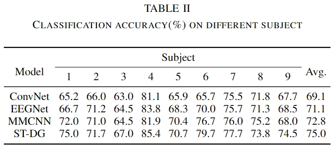
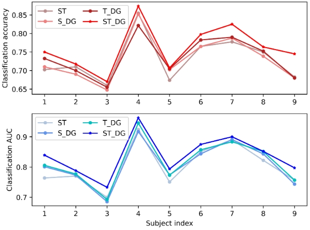

若公式无法正常显示，推荐使用 [GitHub with MathJax](https://chrome.google.com/webstore/detail/github-with-mathjax/ioemnmodlmafdkllaclgeombjnmnbima) 插件，或直接阅读 [HTML版](https://ziyujia.github.io/Chinese-Reading-Materials/Materials/SalientSleepNet/SalientSleepNet.html) / [PDF版](SalientSleepNet.pdf)

---

Motor imagery (MI) 已经成为脑机接口（BCI）研究中的经典范例。近年来，随着深度学习技术的进步，如卷积神经网络（CNNs）和循环神经网络（RNNs）的应用，已经运动想象分类领域取得了成功。但CNNs和RNNs并不能有效地提取大脑空间和时间信息，此外，不同个体主体之间的差异进一步复杂化了分类过程。为了解决这些问题，本文提出了一种基于域泛化的新型时空Transformer（ST-DG）用于EEG信号进行MI分类。该框架利用了一个时空Transformer架构来捕捉大脑的基本时空特征，同时利用域泛化技术来解决跨主体的变异性，并提高模型的泛化性能。在 BCI-IV 2a和 BCI-IV 2b 数据集的跨被试的实验中优于其它SOTA模型。

**论文链接：**

https://ieeexplore.ieee.org/document/10394657

**论文代码链接：**

https://github.com/ziyujia/SalientSleepNet

[//]: #
## **01. 背景简介**

运动想象（Motor Imagery, MI），顾名思义，人在想象自己肢体（或肌肉）运动但没有实际运动输出时，人的特定脑区仍会有激活。
通过分析脑电信号，检测识别不同脑区的激活效果来判断用户意图，进而实现人脑与外部设备之间的直接通信与控制。
基于运动想象的脑机接口系统主要由三部分模块组成：EEG信号采集、信号处理及解码、控制命令输出。
其中，EEG信号采集模块负责采集被试的脑电进行放大；
信号处理及解码进行EEG解码，对信号进行滤波预处理,提取EEG的特征，然后分类器对特征进行分类；
<mark>运动想象系统的核心问题在于如何对有效地对EEG信号进行解码，其中，特征提取算法和分类器设计是解码的关键所在。</mark>
目前常见的运动想象部位为：左手，右手，双脚和舌头，基本是一个多分类问题。

## **02. 动机**

### **2.1 挑战**

#### 2.1.1 缺乏有效提取脑空间和时间信息的方法

在EEG信号中，脑电时间序列的时空特征未被很好的利用。
CNN和RNN模型在EEG信号的时空特征捕捉上有一些缺点。我们从归纳偏置（Inductive bias）[^1]的角度来思考这个问题。
CNN方法具有平移不变性和局部性的归纳偏置，在捕捉空间不变和局部特征上具有优势；
RNN方法具有时间变换不变性和序列性的归纳偏置，擅长捕捉EEG信号的时间信息。
然而，CNN方法可能难以保留EEG时间序列数据中的某些时间细节，而RNNs只考虑若干步之前和当前情况，
可能会错过嵌入在EEG信号中的信息。

#### 2.1.2 受试者差异性问题尤为突出

多尺度的睡眠过渡规则未被很好的利用。在睡眠过程中，人的大脑在不同的睡眠阶段之间经历着一系列的变化。这些变化的模式被概括为睡眠标准中的过渡规则。睡眠专家通常根据这些规则，结合其邻近的睡眠阶段来确定当前的睡眠阶段。图2展示了AASM睡眠标准中的睡眠过渡规则具有的多尺度特性。为了捕获睡眠过渡规则，一些包含RNN的混合模型经常被使用。然而大多数现有的工作忽略了对睡眠过渡规则的多尺度特征的显式捕捉。此外现有模型表明RNN模块可以被前馈系统（如CNN的变体）取代，并且不会牺牲准确率。

### **2.2 贡献**

1. 将Transformer和Domain Generalization相结合，用于运动想象分类。
2. 设计了一个时空Transformer模块，用于捕捉EEG信号中的时空特征。
3. 设计了一个域泛化模块，用于捕捉跨被试不变的特征，解决被试差异性的问题。
4. 实验结果表明，与baseline方法相比，ST-DG达到了领域内最先进的性能。

## **03. 基于域泛化的时空Transformer**

ST-DG的总体架构如图1所示，网络的两个关键模块如下：

1）时空Transformer模块，学习EEG信号中的时间特征；

2）域泛化模块，利用EEG序列被试标签，构造domain label，在Domain Generalization的框架下进行。

### **3.1 时空Transformer模块**

脑电信号在不同运动想象任务下，时空特征是一种非常有效的特征。我们设计了一种时空Transformer用于动态捕获这些有价值的特征。
该模块由两个子组件构成：空间Transformer与时间Transformer。该模块的整体结构如图2所示。

首先，来自不同被试的EEG信号被混合在一起，形成了整体的三维张量（样本数，通道数，时间步长）。
为了后文的表述方便，我们将样本数的维度省去，将输入网络第一层的数据维度表示成：

$$
X \in R^{C \times T}

$$

齐中$C$表示通道数，$T$表示时间步长。

1. 对于一个2D的原始输入$X$ ，从EEG脑电通道维度（空间），利用Transformer Encoder的结构，计算特征图：

$$
Q,K,V = \operatorname{Linear}(X), X \in R^{C \times T}

$$

$$
\operatorname{Attention_s}(Q,K,V) = \operatorname{softmax}(\frac{QK^T}{\sqrt{d_s}})V

$$

2. 对于一个2D的原始输入$X$ ，从EEG时间步长的维度（时间），利用Transformer Encoder的结构，计算特征图：

$$
{\operatorname{Attention_t}(Q,K,V)} = \operatorname{softmax}(\frac{Q^T{K}}{\sqrt{d_t}})V^T

$$

$$
\operatorname{head_t} = \operatorname{Attention_t}(Q{W_i}^Q,K{W_i}^K,V{W_i}^V)

$$

$$
\operatorname{MultiHead} = \operatorname{Concat({head_1},...{head_h})}{W^O}

$$

在分别经过时空Transformer的Encoder层后，特征图的维度并没有发生变化，${Attention_s}\in R^{C \times T}$, ${Attention_t}\in R^{T \times C}$

3. 为了将时间空间的Transformer特征图进行融合，我们将特征图进行加权求和，如下所示：

$$
\operatorname{FeatureMap} = Attention_s + （1-\alpha）* Attention_t

$$

其中$\alpha$是网络中一个可学习的参数。

### **3.2 域泛化模块**

受试者差异性的问题在运动想象任务中比较普遍 。为了缓解个体间差异的影响，我们设计了一个域泛化方法来提升模型在跨被试情形下的泛化性能。在域泛化的框架下，整个模型可以被看成三个部分：

1. 特征提取器（Label Predictor）

$$
{\mathbb{X}} = {\mathcal{G}_f(X;\theta_f)}

$$

其中 $X$ 表示模型一开始的输入数据，$theta_f$ 表示模型特征提取器部分（ST-Transformer）的可训练参数，$\mathbb{X}$ 对应于嵌入了时间和空间信息的特征图。

2. 类别判别器（Label Predictor） 和 域判别器（Domain Classifier）

我们将经过特征提取器的特征图分别输入类别判别器和域判别器，如下所示：

$$
\hat{y_i} = \operatorname{softmax}({\mathcal{G}_l(\mathbb{X}_i;\theta_y)})

$$

$$
\hat{d_i} = \operatorname{softmax}({\mathcal{G}_d(\mathbb{X}_i;\theta_d)})

$$

其中$\mathbb{X}_i$表示源自第$i$个样本的特征图，$\mathcal{G}_l$和$\mathcal{G}_d$结果$y_i$和$d_i$都是一个多分类分类器的输出，它们的损失函数可以定义为：

$$
{\mathcal{L}_y = -\frac{1}{N}{{\sum_{i=1}^N}{\sum_{j=1}^{C_y}}y_{i,j}} {log}\hat{y_{i,j}}}

$$

$$
{\mathcal{L}_d = -\frac{1}{N}{{\sum_{i=1}^N}{\sum_{j=1}^{C_d}}d_{i,j}} {log}\hat{d_{i,j}}}

$$

$$
{\mathcal{L}_{DG} = -\frac{1}{N}{{\sum_{i=1}^N}{\sum_{j=1}^{C_y}}y_{i,j}} {log}\hat{y_{i,j}} + {\lambda}\frac{1}{N}{{\sum_{i=1}^N}{\sum_{j=1}^{C_d}}d_{i,j}} {log}\hat{d_{i,j}}}

$$

其中，为了建立类别判别器和域判别器的对抗关系，我们在反向传播的过程中引入了梯度反转层（GRL），使得我们的模型能够将时空特征和域不变特征的学习融合在同一个框架内：在实现整体的损失最小化的情况下，即模型能够很好的区分运动想象的具体类别；但域分类器的损失最大，即模型无法区分该样本来自于哪个被试。通过这种方法，模型将尽可能地学习跨被试不变的特征，从而提高泛化性能。

## **04. 实验**

本文在BCI-2A和BCI2B两个数据集上检验了ST-DG的性能，之后与3种Baseline方法进行了比较，结果如下表所示，更多的实验设置、Baseline介绍等请参阅我们的论文原文。

实验结果表明，与其他基准方法相比，ST-DG在跨被试的试验下获得了最佳的整体性能。

同时，为了验证我们各模块的有效性，我们将ST-DG各个组件进行拆分进行了消融实验，实验结果如下所示：

实验结果表明，ST-DG的组合，是最优的。

## **05. 结论**

本文提出了一种用于MI分类的创新方法：ST-DG。 ST-DG不仅考虑了脑电信号的空间和时间动态特征，还考虑了受试者差异的问题。 具体来说，本文设计了一种时空Transformer，以有效地捕获与MI分类最相关的时空特征。此外，通过将域泛化和时空Transformer集成到一个统一的框架中，ST-DG成功地提取了跨被试不变的特征。通过对两个公开可用的数据集进行的实验评估，证明了ST-DG的最优性能。同时，我们的方法可以很方便的用于各种时间序列分类场景。

[^1]: https://lolitasian.blog.csdn.net/article/details/121656279
